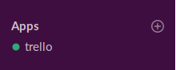
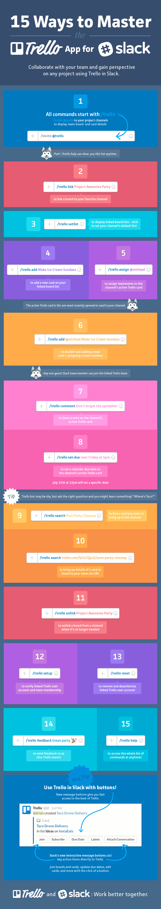
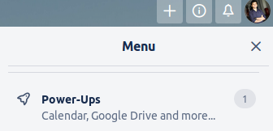
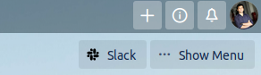
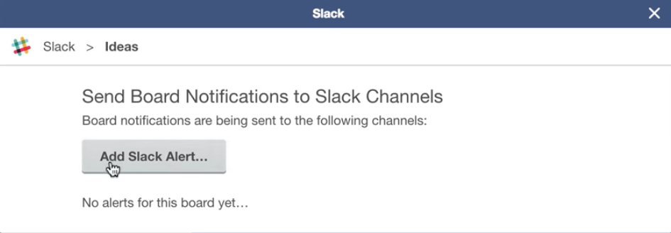
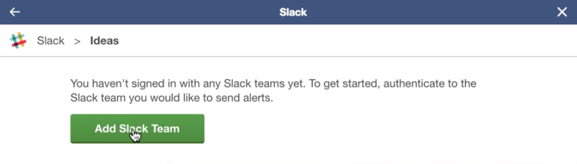
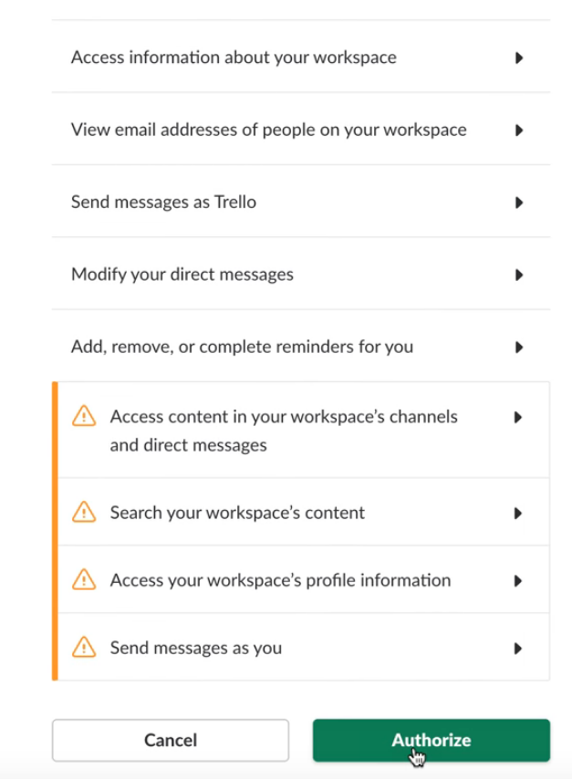
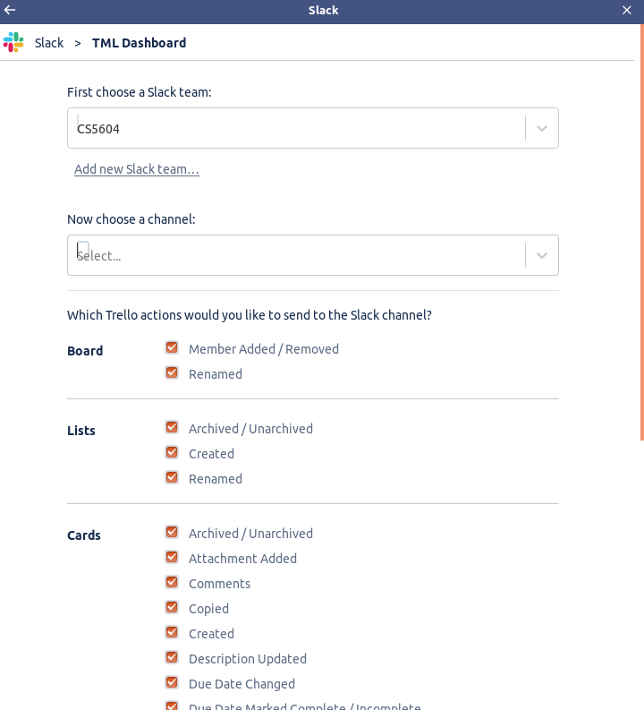

There are two installation, one is to use Trello commands in Slack, and another one is to get notification of any changes to the Trello dashboard on the Slack channel. 

Both of the installation is needed to be done only once per Slack channel and per Trello dashboard. 

## Using Trello in Slack

The Trello dashboard can be integrated in the Slack using the following steps:

1. Sign in to the Slack and the Trello.
2. On the left sidebar, locate the **"Apps"** options. Click the **"+"** sign beside the "Apps" option. Browse **"Trello"** and install it. Once installed, you would be able to see **"trello"** under the **"Apps"** option.

3. Go to the Slack channel, such as **#tml**, where you want to connect the Trello dashboard. 

4. Make sure there is at least one list in the Trello dashboard that you want to connect to the Slack channel. 

5. Copy the link of the Trello dashboard and paste it as following:

**/trello link <trello_dashboard_link>**

6. Once you press Enter, you would be able to update the Trello dashboard from Slack. 

7. You can try the following commands on your Slack channel now. 

## Using Slack in Trello

With the following steps, you can connect the Slack channel with Trello, so that any change you make on the Trello dashboard will send a notification to the Slack channel. 

1. Go to the Trello dashboard and click on the **"Show Menu"** button on the right. 

2. Locate the **"Power-Ups"** option from the menu and click it.

3. Browse **"Slack"** in the search bar and select to install it. 

4. Now click on the **"Slack"** button on the right beside **"Show Menu"** button.

5. Once prompted, click on the **"Add Slack Alert"** button.

6. Then click on the **"Add Slack Team"** button. 

7. Sign in to your Slack channel, if you are not already. Otherwise, authorize slack channel by clicking on the **"Authorize"** button.

8. In the new window, you would be able to choose a Slack team (in this case "CS5604") and a channel. Select your respective channel. Once completed, click on the **"Done"** command on the bottom right. 

9. Now you should be able to see the channel is connected to the Trello dashboard. Any changes made to the dashboard with send a notification to the Slack channel. 